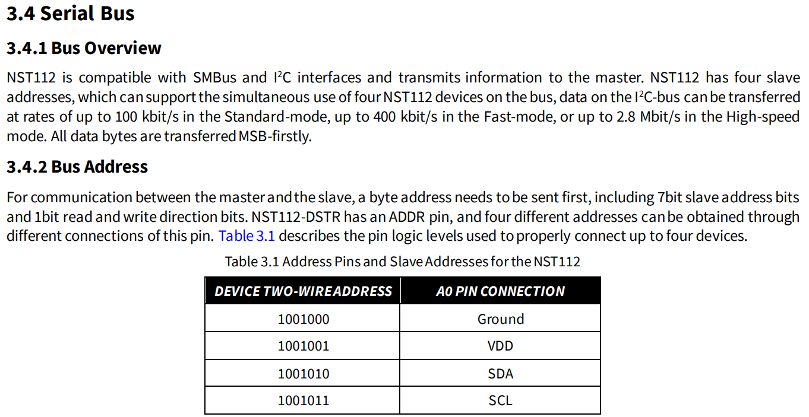

# TM4C129-Project

## :book: 简介

该项目是武汉大学与湖北汽车工业学院电子设计竞赛实验室控制组，基于自主设计的Tiva-C™系列MCU——TM4C1290NCPDT驱动板所开发的配套驱动软件。

## :rocket: 功能介绍

### 通信

#### 串口通信

1. 单字节串口接收中断接收数据
2. 环形接收缓冲区
3. 双缓冲发送缓冲区
4. 数据包解析器
5. 行接收模式

#### SPI通信

1. LCD及OLED显示屏
2. ICM20602 6轴运动传感器

### 显示屏

#### 7针SPI OLED驱动

#### SPI-LCD

### 电机驱动

#### 电流环控制

开发中...

#### 速度环控制

#### 位置环控制

精度取决于编码器精度及电机属性。在使用13线编码器、1:30转速比情况下误差不超过3度。滞回误差不超过5度。

### 姿态控制

#### 轮式里程计

#### IMU

型号：ICM20602

## :rocket: 板上资源列表


### UART

* UART0 - USB串口
* UART1 - Jetson Nano
* UART3 - OpenMV
* UART4 - 蓝牙（板载HC-09或蓝牙直插模块）
* UART5 - WiFi模块插口
* UART6 - 无线调试器/无线预留串口

### I2C

* I2C0 - IST8310 / 预留接口
* I2C2 - 三个PCA9685
* I2C4 - 预留接口
* I2C5 - 预留接口

### SPI

* SSI0 - ICM20602
* SSI2 - FLASH / 扩展SPI接口

### CAN

### PWM

* M0PWM0 - 电机1（左前轮）信号
* M0PWM1 - 电机2（左后轮）信号
* M0PWM2 - 电机3（右前轮）信号
* M0PWM3 - 电机4（右后轮）信号
* M0PWM4 - 蜂鸣器信号
* M0PWM5 - 外接灯条无极调光

### ADC

每个ADC通道均使用LM324作隔离。

* ADC0_Channel0~7 - 8路模拟量寻迹模块或用于其他测量
* ADC0_Channel8~11 - 4路直流减速电机电流检测
* ADC0_Channel12 - 电池电压检测
* ADC0_Channel13 - 电池电流检测
* ADC0_Channel14~15 - 两路ADC预留接口

### 继电器

高电平开启，低电平关断。

* 1号继电器 - PH2
* 2号继电器 - PH3
* 3号继电器 - PF4

### PCA9685

PCA9685的I2C地址可通过焊上或焊下芯片地址线上的0欧电阻来更改

**PCA9685 1号**

16路舵机

**PCA9685 2号**

* 输出0 - 三色LED1_R
* 输出1 - 三色LED1_G
* 输出2 - 三色LED1_B
* 输出3~8 - 单色LED

**PCA9685 3号**

16路扩展口

### LED灯

只有LED2（RGB彩灯）可以由单片机直接控制，其余LED均由PCA9685来控制。

* LED2 - 红(`PL0`) | 绿(`PL1`) | 蓝(`PL2`)

### 直流减速电机编码器

1号电机（左前轮）A相:`PM0` ; B相:`PM1`

2号电机（左后轮）A相:`PM2` ; B相:`PM3`

3号电机（右前轮）A相:`PM4` ; B相:`PM5`

4号电机（右后轮）A相:`PM6` ; B相:`PM7`

### 温度传感器

温度传感器NST112的ADD0引脚按照不同的接法可以生成最多4个I2C地址，也就是说，一条I2C总线上最多可以挂载4个温度传感器，这4个温度传感器的地址均不相同。



**以下是第一组温度传感器：**

主板电机1和电机2处有一个温度传感器，ADD0引脚被**上拉**，地址是`0x49`

主板电机3和电机4处有一个温度传感器，ADD0引脚**接地**，地址是`0x48`

主板外界灯条插口处有一个温度传感器，ADD0引脚**接SCL**，地址是`0x4B`

电源板12V输出对应一个温度传感器，ADD0引脚**接SDA**，地址是`0x4A`

**以下是第二组温度传感器：**

电源板4路5V输出每路都有一个温度传感器，地址与上面相同。

8个温度传感器各有一条警报线，可以作为**外部中断源**。该板将8根警报线全部连接到`PQ6`

## :rocket: API

### LED灯控制

### ADC采样

#### 电池电压电流采样

```c
ADC_GetBatteryVoltAndCurrent(uint32_t *ADCResultBuf)
```

#### 4路直流电机电流采样

```c
void ADC_GetMotorCurrent(uint32_t *ADCResultBuf)
```

#### 8路循迹模块采样

#### MCU内部温度传感器温度采样

```c
void ADC_GetInnerTemp(uint32_t *ADCResultBuf)
```
